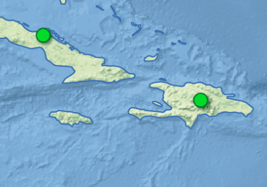

```{r setOpts, include = FALSE}
knitr::opts_chunk$set(
  collapse = TRUE,
  comment = "#>"
)
```

```{r setup}
library(sf)
library(geojson)
library(neotoma2)
```

## Neotoma Data Structure

Data in Neotoma is associated with sites, specific locations with lat/long coordinates. Within a site, there may be one or more **collection units** -- locations at which samples are physically collected within the site. For example, an archaeological **site** may have one or more **collection units**, pits within a broader dig site; a pollen sampling **site** on a lake may have multiple **collection units** -- core sites within the lake basin. Collection units may have higher resolution GPS locations, but are considered to be part of the broader site. Within a **collection unit** data is collected at various **analysis units** from which **samples** are obtained.

Because Neotoma is made up of a number of constituent databases (e.g., the Indo-Pacific Pollen Database, NANODe, FAUNMAP), a set of **sample**s associated with a **collection unit** are assigned to a single **dataset** associated with a particular **dataset type** and **constituent database**.

Researchers often begin by searching for sites within a particular study area, whether that is defined by geographic or political boundaries.  From there they interrogate the available datasets for their particular dataset type of interest.  When they find records of interest, they will then often call for the data and associated chronologies.

The `neotoma2` R package is intended to act as the intermediary to support these research activities using the Neotoma Paleoecology Database.

### Package Requirements

The earlier `neotoma` package tried to use base R as much as possible.  The `neotoma2` package now draws primarily on `dplyr` and `purrr` packages from the `tidyverse`, and on the `sf` spatial data package. The choice to integrate `tidyverse` packages was made largely because of the current ubiquity of the `tidyverse` in R education.

There are some namespace overlaps, for example with the `filter()` function.  Depending on the order with which packages are loaded you may get errors using these functions.  If that's the case, one way of bug-checking is to try calling the function explicitly from the package: `neotoma2::filter(...)`.  This will ensure it is the `filter()` function from the `neotoma2` package.

## Site Searches

The highest level object in Neotoma is the **site**.  Sites have spatial coordinates and, in many cases, additional metadata related to lake parameters, or other site-specific properties.

Sites can be searched using the `get_sites()` function, or, can be created using the `set_site()` function. A single `site` object is a special object in R, that can be combined with other sites into a `sites` object.  A `sites` object is effectively a `list()` of `site` objects with special methods for printing, plotting and exporting information.



### Finding sites

All sites in Neotoma have a unique numeric identifier.  With the `neotoma2` package you can search for a site using the `get_sites()` function by its unique site id (`siteid`), by name (`sitename`), by altitude (`altmin`, `altmax`), by geopolitical name (`gpid`), or by location (`loc`).

If we're looking for a site and we know its specific identifier, we can use the simplest implementation of `get_sites()`.  Here we are searching for a site (Alexander Lake), where we know that the siteid for the record in Neotoma is `24`:

```{r getSiteBySiteID}
# Search for site by a single numeric ID:
alex <- get_sites(24)
alex

# Search for sites with multiple IDs using c():
multiple_sites <- get_sites(c(24, 47))
multiple_sites
```

#### Searching for sites by name

Often we do not know the particular `siteid`.  If we're looking for a site and we know its name or a part of its name, we can search using the function with the `sitename` argument, `get_site(sitename = 'XXX')`, where `'XXX'` is the site name.  This does not support multiple text strings (i.e., you can't use `c()`).

```{r getsitename}
alex <- get_sites(sitename = "Alexander Lake")
alex
```

Neotoma uses a Postgres Database to manage data.  Postgres uses the `%` sign as a general wildcard, so we can use the `%` in the `sitename` argument operator to help us find sites when we're not sure the exact match.  Note that the search is case **insensitive** so a search for `alex%` or `Alex%` will return the same results.

```{r sitewithwildcardname}
alex <- get_sites(sitename = 'Alex%')
alex
```

Since this new `sites` object has `r length(alex@sites)` elements that belong to `site`, we may want to access only one of the objects, or sets of metadata from our variable `alex`.

### Accessing `sites` metadata

Although the `sites` are structured using S4 objects (see S4 documentation here), we've added helper functions to make accessing elements easier for users.  

The `alex` object is composed of several smaller objects of class `site`.  We can call any individual site using `[[ ]]`, placing the index of the desired object between the brackets.  Then we can also call the particular variable we want using the `$` symbol.

```{r extractElement}
alex[[1]]$siteid
```

The elements within a `site` are the same as the defined columns within the Neotoma [`ndb.sites`](https://open.neotomadb.org/dbtables) table, with the exception of the `collunits` slot, which contains the collection units and associated datasets that are found within a site.  You can see all the `site` slots using the `names()` function.  You can select individual elements of a `site`, and you can assign values to these parameters:

```{r showallNamesSite}
names(alex[[1]])

# Modify a value using $<- assignment:
alex[[1]]$area
alex[[1]]$area <- 100
alex[[1]]$area

# Modify a value using [<- assignment:
alex[[1]]["area"] <- 30
# alex[[1]][7] <- 30  <- Fails because the `Notes` field expects a character string.
```

In this way we can add information programmatically, for example, by working interactively with a digital elevation model or hydrographic data to obtain lake area measurements.  Although not currently implemented, the goal is to support direct upload of updated information by users.

### Creating a Site

As explained above, a `site` is the fundamental unit of the Neotoma Database.  If you are working with your own data, you might want to create a `site` object to allow it to interact with other data within Neotoma.  You can create a site with the `set_site()` function. It will ask you to provide important information such as `sitename`, `lat`, and `long` attributes.

```{r setsitefunction}
my_site <- set_site(sitename = "My Lake", 
                    geography = st_sf(a = 3, st_sfc(st_point(1:2))), 
                    description = "my lake", 
                    altitude = 30)
my_site
```

If we have a set of sites that we are analyzing, we can add the new site to the set of sites, either by appending it to the end, using `c()`, or by replacing a particular element using `[[<-`.

This method allows us to begin modifying site information for existing sites if we have updated knowledge about site properties.

```{r addtosites}
# Add a new site that's been edited using set_site()
longer_alex <- c(alex, my_site)
alex[[3]] <- my_site

# Update a value within an existing `sites` object:
alex[[2]] <- set_site(alex[[2]], altitude = 3000)
```

## Datasets

If you need to get to a deeper level of the sites object, you may want to look at the `get_datasets()` function.  You can use `get_datasets()` using search parameters, or you can use it on an existing `sites` object, such as our prior `alex` dataset.

`get_datasets()` adds additional metadata to the `site` objects, letting us know which `datasettypes` are associated with a site, and the dataset sample locations at the site.

Getting the datasets by id is the easiest call, you can also pass a vector of IDs or if you already have a `sites` object, you can pass a sites object. Be careful, `get_datasets()` does not take `sitename` or `siteid` as inputs, if you wish to use those you can chain `get_sites()` and `get_datasets()`.

```{r getdatasetsbyid}
# Getting datasets by ID
my_datasets <- get_datasets(c(5, 10, 15, 20))
my_datasets
```

You can also retrieve datasets by type directly from the API.

```{r getdatasetsbytype}
# Getting datasets by type
my_pollen_datasets <- get_datasets(datasettype = "pollen", limit = 25)
my_pollen_datasets
```

It can be computationally intensive to obtain the full set of records for `sites` or `datasets`. By default the `limit` for all queries is `25`.  The default `offset` is `0`.  To capture all results it is possible to add `limit=99999999` or some similarly high number.  **However**, this is hard on the Neotoma servers.  Best practice is to loop through results, using `limit` and `offset`, for example, in a `while` loop.  In a result set of 100 records, the `limit`, when `offset` is 0 (the default), ensures that only the first 25 records are returned.  Keeping the `limit` at 25, and increasing the `offset` to 25 would give us the next 25 records.

We can use that in a `while` loop in R in the following way:

```{r searchOffset, eval=FALSE}
run = TRUE
offset <- 0

while(run) {
  sites <- get_sites(offset=offset, limit = 500)
  if(length(sites) == 0) {
    run = FALSE
  }
  if(exists('allSites')) {
    allSites <- c(allSites, sites)
  } else {
    allSites <- sites
  }
  offset <- offset + 500
}
```

It can be computationally intensive to obtain the full set of records for `sites` or `datasets`. By default the `limit` for all queries is `25`.  The default `offset` is `0`.  To capture all results it is possible to add the `limit=99999999` or some similarly high number.  **However**, this is hard on the Neotoma servers.  Best practice is to loop through results, you can do that automatically using the `all_data=TRUE` argument.

We can use that `all_data=TRUE` in R in the following way:

```{r all_data, eval=FALSE}

allSites <- get_sites(all_data = TRUE)
allSites
 
```

Following this  can see that the total sites returned is equal to the total number of sites in Neotoma.

You can get the coordinates to create a GeoJson bounding box from [here](https://geojson.io/#map=2/20.0/0.0)

Accessing datasets by bounding box:

```{r bounding box}
brazil <- '{"type": "Polygon", 
            "coordinates": [[
                [-73.125, -9.102],
                [-56.953, -33.138],
                [-36.563, -7.711],
                [-68.203, 13.923],
                [-73.125, -9.102]
              ]]}'

# We can make the geojson a spatial object if we want to use the
# functionality of the `sf` package.
brazil_sf <- geojsonsf::geojson_sf(brazil)

brazil_datasets <- get_datasets(loc = brazil[1])
```

Now we have an object called `brazil_datasets` that contains `r length(brazil_datasets)`.  

You can plot these findings!

```{r leafletBrasil}
plotLeaflet(brazil_datasets)
```

## Filtering Records

Sometimes we take a large number of records, do some analysis, and then choose to select a subset.  For example, we may want to select all sites in a region, and then subset those by dataset type.  If we want to look at only the geochronological datasets from Brasil, we can start with the set of records returned from our `get_datasets()` query, and then use the `filter` function in `neotoma2` to select only those datasets that are geochronologic:

```{r filterBrasil}
brasil_dates <- neotoma2::filter(brazil_datasets, datasettype == "geochronologic")

# or:

brasil_dates <- brazil_datasets %>% 
  neotoma2::filter(datasettype == "geochronologic")

# With boolean operators:

brasil_space <- brazil_datasets %>% filter(lat > -18 & lat < -16)
```

The `filter()` function takes as the first argument, a datasets object, followed by the critieria we want to use to filter. Current supported criteria includes:

* `lat`
* `long`
* `elev`
* `datasettype`

You also need to make sure that you accompany any of these terms with the following boolean operators: `<`, `>` or `==`, `!=`. Datasettype has to be of type string, while the other terms must be numeric.  If you need to filter by the same argument, let's say, you need to filter "geochronologic" and "pollen datatypes, then you will also make use of `&` and `|` operators.

```{r, sitesbyname}
Names_744BH <- c("Bald Hill", "Blake (sutton)", "High (sudbry)", "Holland", "Little Hosmer", "Long (grnsbo)", "Long (shefld)", "Round (shefld)")

new_sites <- c()
for (Number in Names_744BH) {
  sites <- get_sites(sitename = Number)
  new_sites <- c(new_sites, sites)}
new_sites
```

## Publications

Many Neotoma records have publications associated with them.  The `publication` object (and the `publications` collection) provide the opportunity to do this.  The [`publication`](http://open.neotomadb.org/dbschema/tables/publications.html) table in Neotoma contains an extensive number of fields.  The methods for `publications` in the `neotoma2` package provide us with tools to retrieve publication data from Neotoma, to set and manipulate publication data locally, and to retrieve publication data from external sources (e.g., using a DOI).

### `get_publications()` from Neotoma

Publications in Neotoma can be discovered using a number of parameters including   

The most simple case is a search for a publication based on one or more publication IDs.  Most people do not know the unique publication ID of individual articles, but this provides a simple method to highlight the way Neotoma retrieves and presents publication information.

#### Get Publication By ID

We can use a single publication ID or multiple IDs.  In either case the API returns the publication(s) and creates a new `publications` object (which consists of multiple individual `publication`s).  

```{r pubsbyid}
one <- get_publications(12)
two <- get_publications(c(12,14))
```

From there we can then then subset and extract elements from the list using the standard `[[` format.  For example:

```{r showSinglePub}
two[[2]]
```

Will return the second publication in the list, corresponding to the publication with `publicationid` 14 in this case.

#### Get Publication using Search

We can also use search elements to search for publications.  The `get_publication` method uses the Neotoma API to search for publications.  We can search using the following properties:

* `publicationid`
* `datasetid`
* `siteid`
* `familyname`
* `pubtype`
* `year`
* `search`
* `limit`
* `offset`

```{r fulltestPubSearch}
michPubs <- get_publications(search = "Michigan", limit = 2)
```

This results in a set of `r length(michPubs)` publications from Neotoma, equal to the `limit`.  If the number of matching publications is less than the limit then the `length()` will be smaller.

Text matching in Neotoma is approximate, meaning it is a measure of the overall similarity between the search string and the set of article titles.  This means that using a nonsense string may still return results results:

```{r nonsenseSearch}
noise <- get_publications(search = "Canada Banada Nanada", limit = 5)
```

This returns a result set of length `r length(noise)`.

This returns the (Neotoma) ID, the citation and the publication DOI (if that is stored in Neotoma).  We can get the first publication using the standard `[[` nomenclature:

```{r getSecondPub}
two[[1]]
```

The output will look similar to the output for `two` above, however you will see that only a single result will be returned and the class (for a single publication) will be of type `publication` (as opposed to `publications`).  

We can select an array of `publication` objects using the `[[` method, either as a sequence (`1:10`, or as a numeric vector (`c(1,2,3)`)):

```{r subsetPubs}
# Select publications with Neotoma Publication IDs 1 - 10.
pubArray <- get_publications(1:10)
# Select the first five publications:
subPub <- pubArray[[1:5]]
subPub
```

#### Create (or Import) New Publications

Just as we can use the `set_sites()` function to set new site information, we can also create new publication information using `set_publications()`.  With `set_publications()` you can enter as much or as little of the article metadata as you'd like, but it's designed (in part) to use the CrossRef API to return information from a DOI.

```{r setNewPub}
new_pub <- set_publications(articletitle = 'Myrtle Lake: a late- and post-glacial pollen diagram from northern Minnesota',
                           journal = 'Canadian Journal of Botany',
                           volume = 46)
```

A `publication` has a large number of slots that can be defined.  These may be left blank, they may be set directly after the publication is defined:

```{r setPubValue}
new_pub@pages <- '1397-1410'
```

#### Validate New Publications

## Examine Neotoma Data

### Down Core Data

Once we've obtained a site we can begin to look at the raw data within the datasets.

```{r downloadData}
mySites <- get_downloads(brazil_datasets)
```
